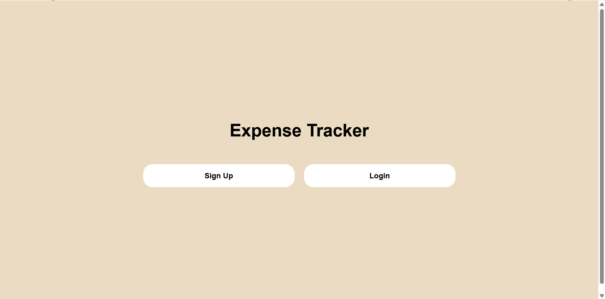
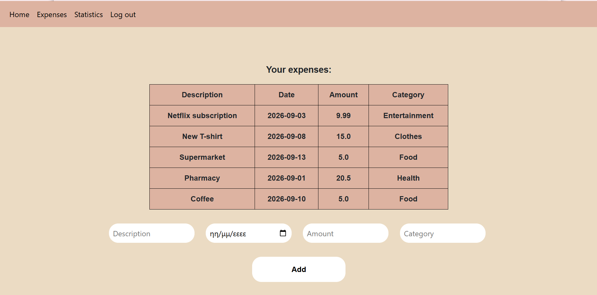
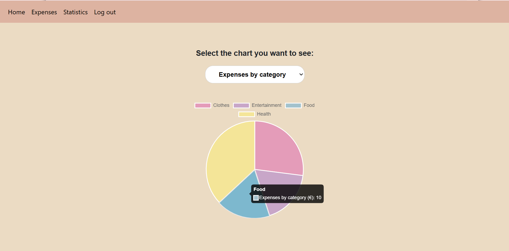
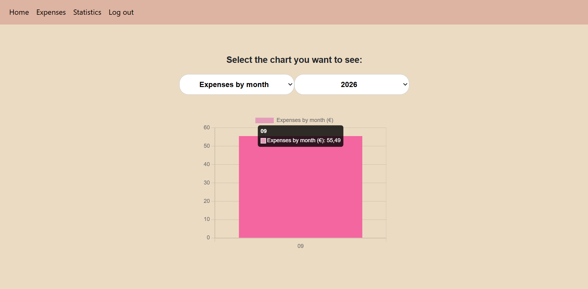
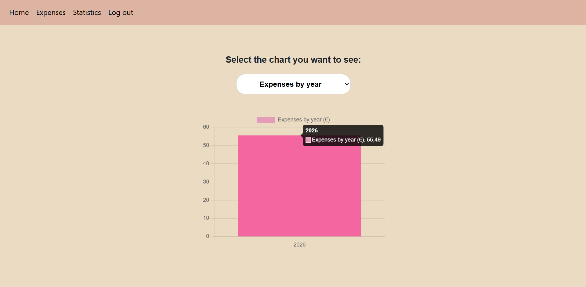

# Expense Tracker

Personal expense tracking web application.

## Features

- User authentication with secure password hashing (bcrypt)
- Track expenses (description, date, amount, category)
- View all expenses in a table
- Statistics with interactive charts:
  - Expenses by category (pie chart)
  - Expenses by year (bar chart)
  - Expenses by month, filterable by year (bar chart)

## Tech Stack

- **Backend:** Python, Flask
- **Database:** SQLite
- **Frontend:** HTML, CSS, JavaScript
- **Libraries:** Flask-Bcrypt, Chart.js, Bootstrap

## Screenshots

- Home page

  
- Expenses page

- Expenses by category

- Expenses by month

- Expenses by year 

## Database Structure

Using SQLite.
Tables:
- user: stores users credentials
- expense: stores the expense data, linked to a user
- category: stores expense categories
- expense_category: junction table linking expenses to categories (many-to-many relationship)

## Installation

1. Clone the repository:

git clone https://github.com/eleftheriaval/expense_tracker.git

cd expense_tracker

2. Create a virtual environment:

python -m venv .venv

3. Activate the virtual environment:

.venv\Scripts\activate (Windows)

source .venv/bin/activate (Mac/Linux)

4. Install dependencies:

pip install -r requirements.txt

5. Create a `.env` file in the project root with the following:

MY_KEY=your_own_random_secret_key_here

6. Run the application:

python app.py

7. Open your browser at `http://127.0.0.1:5000`

## Author

Eleftheria Valacha 
